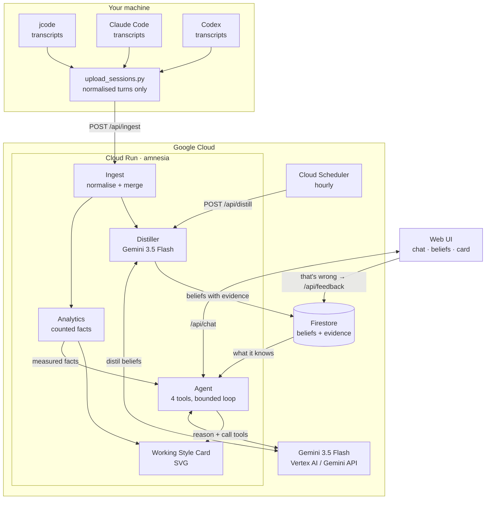

# Amnesia

**Your AI agents forget you every morning. This one doesn't.**

Built for the [All Things Agentic Hackathon](https://allthingsagentichackathon.devpost.com/) · Track: **The Collaborative Partner**

**Live:** <https://amnesia-orkuraibfa-uc.a.run.app>

---

## The problem

You have been working with AI coding agents for months. Claude Code knows nothing about what you did in Cursor yesterday. ChatGPT has never heard of the architecture decision you spent two hours making in Codex last week. Every session, you re-explain who you are, how you like to work, and what you already tried.

The context is not missing. It is sitting on your disk, in the transcripts every one of these tools already writes. Nobody reads it.

## What Amnesia does

Amnesia is a background agent that reads your real coding sessions across every AI client, learns how you actually work, and becomes the memory those agents are missing.

It does three things no chatbot does:

**It arrives already knowing you.** Ask it to plan a task and it does not interrogate you from zero. It knows your projects, your rhythm, and the mistakes you keep making, so the one question it asks is the one its memory genuinely cannot answer.

**It shows its evidence.** Every belief carries the sessions that produced it. Nothing is asserted about you that you cannot trace, challenge, and overrule with one click. A correction outranks anything the model inferred, permanently.

**It notices when you are stuck.** A background pass looks for sessions where effort stopped converting into progress: the same question asked five times, ninety minutes on one thread, wording that says the fix is not landing. That is when a partner should speak up.

And it gives you a **Working Style Card**: a portrait of how you actually work, generated from measured facts, made to be shared.

## Why the numbers are honest

The core design rule is that **measurement outranks inference**.

Session durations are unioned, not summed. Two clients open for an hour is one hour of work, not two. Anything Gemini infers from reading your transcripts is capped at 0.75 confidence; anything counted from timestamps is not. When a distilled belief and a measured fact disagree, the fact wins.

This is not decoration. It is why the number on a card you post publicly is one you can defend.

## Architecture



**The flow that matters:** Cloud Scheduler wakes the service hourly whether or not anyone has the page open. It reads sessions, asks Gemini what they mean, and writes beliefs with their evidence into Firestore. When you next talk to the agent, it is already grounded, and its questions are about the gaps.

## Tech

| Requirement | What Amnesia uses |
| --- | --- |
| Gemini 3.5 or newer | `gemini-3.5-flash` via `google-genai`, for distillation, the agent loop and the card |
| Google Agent Framework | Google GenAI SDK with declared function tools and a bounded tool loop |
| Google Cloud infrastructure | Cloud Run (service), Firestore (memory), Cloud Scheduler (background pass), Cloud Build (image) |
| Reach beyond the app | MCP server, so Claude Code and Cursor read the same memory |

## Run it locally

No Google Cloud account needed. Amnesia falls back to a local JSON store, and reads the transcripts already on your machine.

```bash
git clone <this-repo> && cd amnesia
echo 'GOOGLE_API_KEY=your_key' > .env    # from https://aistudio.google.com/apikey
./scripts/quickstart.sh
```

That installs dependencies, checks what it can read on your machine, prints your real numbers, and serves <http://localhost:8080>. Click **Run background pass** and watch it learn from your own sessions.

Without a key it still runs. Ingestion, measured facts, stuck detection and the card all work with no model at all, so you can see it do something before deciding to give it credentials.

```bash
.venv/bin/python scripts/demo_check.py   # is everything working? what are my numbers?
.venv/bin/python -m pytest tests/ -q     # 72 tests, no network, no cloud
```

## Deploy to Google Cloud

```bash
gcloud auth login
gcloud config set project YOUR_PROJECT

export GOOGLE_API_KEY=your_key
./scripts/deploy.sh
```

It enables the APIs, waits for Artifact Registry, creates the Firestore database, deploys to Cloud Run and registers the hourly Cloud Scheduler job. Safe to re-run.

Then push your local history to it, so the deployed agent has something to learn from:

```bash
.venv/bin/python scripts/upload_sessions.py https://your-service.run.app
curl -X POST https://your-service.run.app/api/distill
```

Only normalised conversation turns leave your machine. Tool output, file contents, reasoning traces and paths are stripped during ingestion, before anything is sent.

## The part that makes it infrastructure

A web UI proves the agent works. The MCP bridge proves it is memory.

```bash
./scripts/install-mcp.sh    # registers Amnesia in Claude Code and Cursor
```

Restart the client and ask it "what do you know about how I work?". It answers from the same beliefs the background pass fills, with the same evidence. Four tools are exposed: `recall_me`, `how_i_work`, `am_i_stuck` and `remember_about_me`.

That last one is the point. Tell Claude Code a preference once, and Cursor knows it too.

## API

| Endpoint | What it does |
| --- | --- |
| `GET /` | The UI: chat, beliefs, measured profile, card |
| `POST /api/chat` | Talk to the agent, grounded in memory |
| `GET /api/memory` | Every belief, with evidence and confidence |
| `POST /api/feedback` | Tell it a belief is wrong; the correction outranks it |
| `POST /api/distill` | The background pass. Driven by Cloud Scheduler |
| `POST /api/ingest` | Receive sessions pushed from a laptop |
| `GET /api/profile` | Measured facts and stuck signals |
| `GET /api/calendar` | Everything the dashboard needs, in one request |
| `GET /api/day/{day}` | One day expanded: sessions, projects, opening messages |
| `POST /mcp` | Remote MCP, so ChatGPT can connect to the same memory |
| `GET /api/card.svg` | The Working Style Card |
| `GET /api/health` | Liveness. Google's frontend intercepts `/healthz`, so this is the reachable one |

## What I learned building this

**The evidence already exists.** Every AI client writes a transcript. The hard part was never collection, it was that nobody reads them, and a transcript says what happened while a person needs to know what it means.

**A guess must never outrank a count.** The first version let Gemini assign its own confidence, and inferred beliefs immediately outranked measured facts in the ranking. Capping inference below measurement fixed the ranking and, more importantly, made the numbers defensible.

**A memory without provenance cannot be corrected.** Once every belief carried its sessions, "that's wrong" became a one-click action with somewhere to put the correction, instead of an argument with a model.

**Truncate from the front.** The outcome of a session is at the end: whether it worked, or whether the person gave up. Early versions truncated the tail and distilled the greeting.

**Cloud Run sets `GOOGLE_CLOUD_PROJECT` on every service.** Passed alongside an API key, the Gemini API rejects the call outright. The first deployed distill pass failed on exactly this while the same code worked locally, so the two credential modes are now separate paths rather than one call with optional arguments.

**The model everyone is demoing on returns 503.** `gemini-3.5-flash` was unavailable under load while `flash-lite` answered in under a second. A live demo cannot pause for capacity, so capacity failures fall through to the next model in the same generation. Bad requests deliberately do not, because retrying a malformed prompt just fails three times more slowly.
